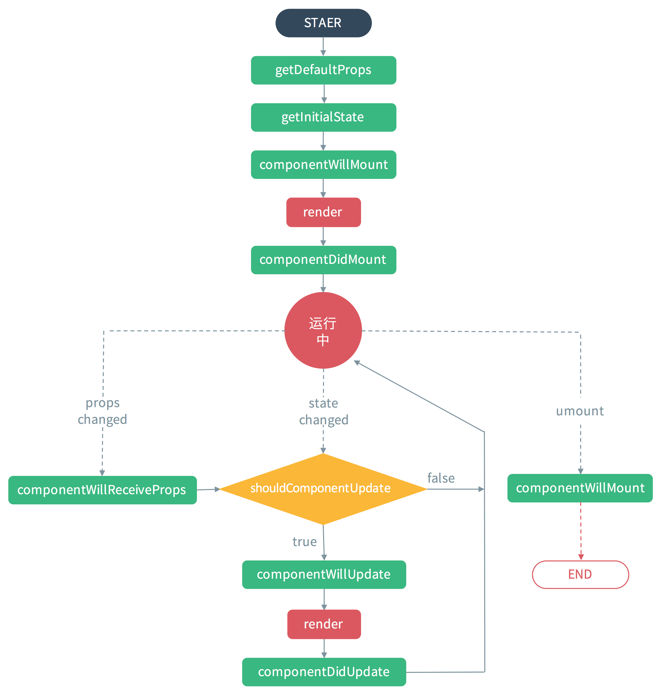

> # Completely conquered ReactJS

    This is a collection of simple demos of React.js.

    These demos are purposely written in a simple and clear style. You will find no difficulty in following them to learn the project.

## [Chapter01:Development Environment Config](https://github.com/MicroKibaco/ReactStudy/tree/master/Chapter01)
- Configure the base runtime environment
    - [React official website](https://facebook.github.io/react/docs/hello-world.html)
    - JSX : html + javaScript ==>Pure javaScript
    - [Bootcdn](http://www.bootcdn.cn/react/)
- UI design and requirements analysis
    - [getbootstrap](http://getbootstrap.com/)
- Embed HTML in JavaScript
- Divide multiple components
- By Curing property data
- Internal status data and add functionality
- ItemEditor Removes the function
- ItemEditor Save the function
- Edit and Removes the implementation of the Item function
- Optimize the first application

### Renderings:Describe Chapter01

## [Chapter02:JSX Intro](https://github.com/MicroKibaco/ReactStudy/tree/master/Chapter02)

- JSX Nature
- Attribute and inline style
- Ternary operation and complex judgment
- The root node's personality
- Comment and the Element characteristics
- Create two kinds of Component

## [Chapter03:React Commpent Lifecycle](https://github.com/MicroKibaco/ReactStudy/tree/master/Chapter03)
- The principle of component lifecycle

</img>

   Lifecycle  | Status
-------- | ---
[init](https://github.com/MicroKibaco/ReactStudy/tree/master/Chapter03/js/app-init.js) | getdefaultProps,getInitState
[mount](https://github.com/MicroKibaco/ReactStudy/tree/master/Chapter03/js/app-mount.js)   | componentWillMount,componentDidMount[only 1 time to change]
[update](https://github.com/MicroKibaco/ReactStudy/tree/master/Chapter03/js/app-update.js)    | componentWillUpdate,shouldComponentUpdate,componentWillReceiveProps,componentDidUpdate
[unmount](https://github.com/MicroKibaco/ReactStudy/tree/master/Chapter03/js/app-unmount.js)      | componentWillUnmount

## [Chapter04:React Commpent Properties](https://github.com/MicroKibaco/ReactStudy/tree/master/Chapter04)
- [Form attribute](https://github.com/MicroKibaco/ReactStudy/tree/master/Chapter04/js/form.js)
- [refs attribute](https://github.com/MicroKibaco/ReactStudy/tree/master/Chapter04/js/ref.js)

## [Chapter05:React Commpent Event](https://github.com/MicroKibaco/ReactStudy/tree/master/Chapter05)
- [Keyboard Event](https://github.com/MicroKibaco/ReactStudy/tree/master/Chapter05/js/keyBoardEvent.js)
- [Mouse Event](https://github.com/MicroKibaco/ReactStudy/tree/master/Chapter05/js/mouseEvent.js)
- [Custom Event](https://github.com/MicroKibaco/ReactStudy/tree/master/Chapter05/js/customEvent.js)

## [Chapter06:Communication Between Components](https://github.com/MicroKibaco/ReactStudy/tree/master/Chapter06)
- [Parent components communicate with Child components](https://github.com/MicroKibaco/ReactStudy/tree/master/Chapter06/js/father2Son.js)
- [Child components communicate with Parent components](https://github.com/MicroKibaco/ReactStudy/tree/master/Chapter06/js/son2Father.js)
- [eventBus one](https://github.com/MicroKibaco/ReactStudy/tree/master/Chapter06/js/eventBus1.js)
- [eventBus two](https://github.com/MicroKibaco/ReactStudy/tree/master/Chapter06/js/eventBus2.js)

## [Chapter07:React Tools](https://github.com/MicroKibaco/ReactStudy/tree/master/Chapter07)

## Useful links
- [react-demos](https://github.com/ruanyf/react-demos)
- [pinggod.com](http://pinggod.com/2015/React-%E7%BB%84%E4%BB%B6%E7%9A%84%E7%94%9F%E5%91%BD%E5%91%A8%E6%9C%9F/)
- [godbasin](https://godbasin.github.io/2016/08/28/react-notes-8-conmunicate-in-react/)

## License
IISC licensed